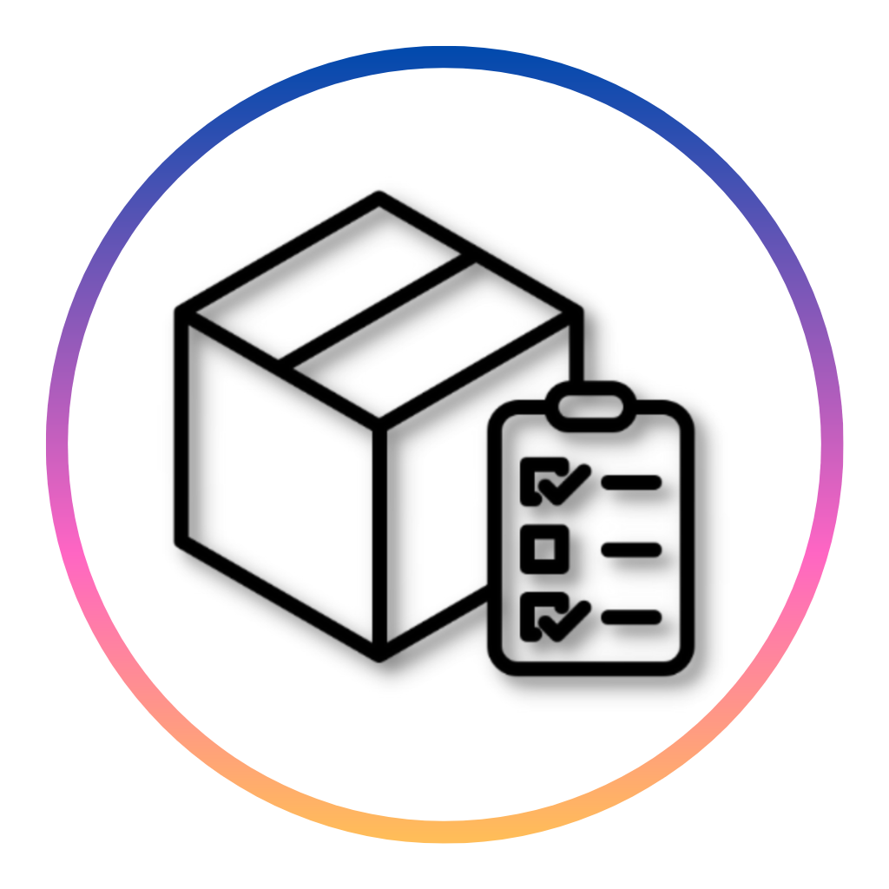
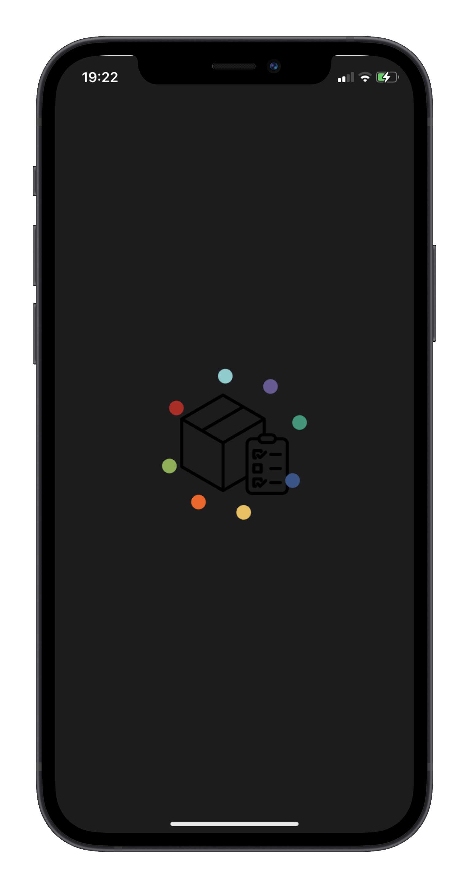
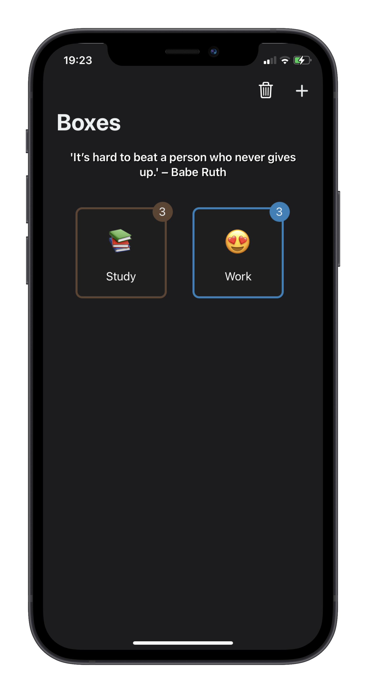
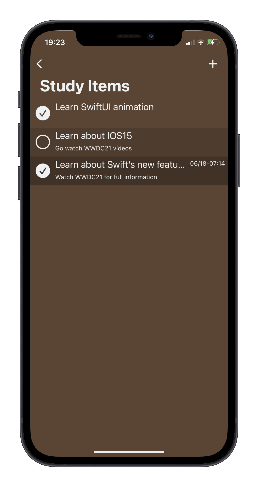
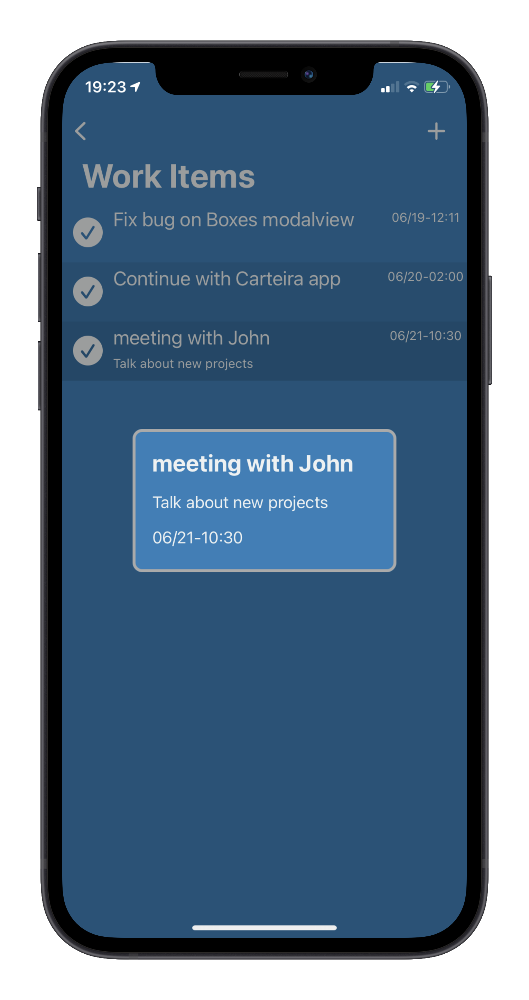
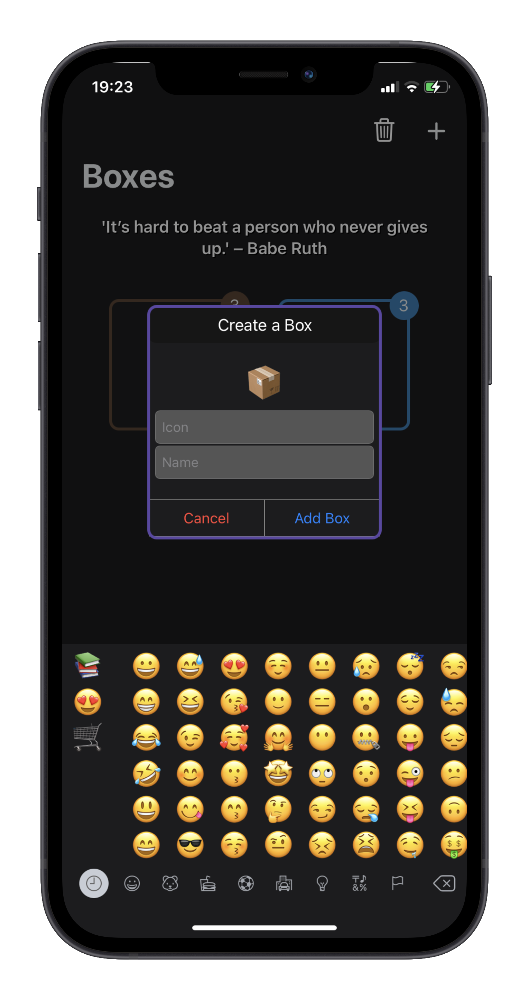
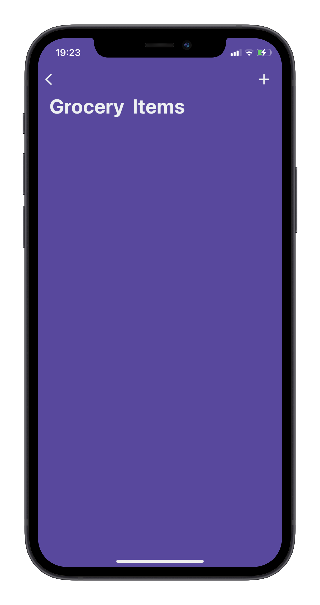

  
  <h1 align="center">Boxes</h1>
  <h3 align="center">A different way of seen a simple and common kind of app, standing out from the crowd, making it appeal more to the public.</h3>
  

    
    
    
    
    
    
  

<h3>How was the creation process for me ? </h3>

Personally it was a very difficult process. It was my first big project building from scratch, so it was challenging in a way, but after you get used to how to really search for something that you don't know, and keep learning in the process, in the end, after everything that you planned it's working just fine, there is only joy, and i have certain that I learned a lot building this app :heart_eyes: 

## Skills
- Swift 5 :bird:
- CoreData :floppy_disk:
- UserNotifications :alarm_clock:
- CoreAnimation
- CocoaPods: [ISEmojiView](https://github.com/isaced/ISEmojiView), [ChameleonFramework](https://github.com/vicc/Chameleon)
- Animation with UIKit :art:
- MVC Design Pattern :books:
- Auto-Layout :triangular_ruler:

## Building Process
1. First I started developing the visual scratch of the app on a piece of paper to get a better idea of what I would have to do
2. Then it was time to code, first I developed the launch screen with the app logo and a quote, meaning that quotes would play a part on the app, after that I created the launch screen animation with the colored circles circling the app logo, with the meaning that colors would be part of the app too. This animation process it was very good for me because made me learn and understand how animations in UIKit worked with CoreAnimation;
3. It was time to create the CoreData items, relationships, and properties;
4. Then I created the first screen, which has a very simple design. It consist in oly one NavigationBar, a label, and a Collection View. The label consist only in a random motivitional quote from a model that i created, so everytime the user opens the app, appears a random motivational quote to give the user that extra energy to complete those tasks;
5. Each CollectionView Cell has it's title, it's emoji, and it's color, all properties of the CoreData, which has a relationship with it's items which has as properties: title, description, done, and deadline;
6. After creating those relationships and the custom views for the creation of a "box" with it's title, it's emoji using [ISEmojiView](https://github.com/isaced/ISEmojiView), and it's random color using [ChameleonFramework](https://github.com/vicc/Chameleon), when you are inside a "box" you can createyou notice that the screen is the same color of the box you created, and as you continuie to create items, the color of each item cell beggins to get darker and darker, but the text color is always in contrast for better visibility, that's all using the [ChameleonFramework](https://github.com/vicc/Chameleon);
7. When you create a item you can choose if it's a DeadLine, that is, you got to do that item before that date and time; When you chose a DeadLine, and with the help of UserNotifications I was able to everytime the user creates a deadLine, it also creates a reminder with that same deadline, so it notifies the user when the time comes, and also when you mark the item as complete, it deletes that reminder, but if you mark as incomplete again, it recreates that reminder;

## Overall
It was a great learning expirence I'm sure, learning how to search on the web how to solve a problem, how to implement something, searching for a good Pod for the project, organizing the CoreData and it's relationships, how to pass those data through different views, making it "talk" to each other, working with UserNotification, CoreAnimations...
Although the app it's done for using on the phone, I did not launched on Apple Store yet, one of the reasons it's because I wanted to make some slight motivication involving the UserNotification and the quotes data, and there is a few bugs to fix, but overall, it's good to go, and I'm sure the user expirience would be different from those other Todo-list apps that we have on the market :grin:
